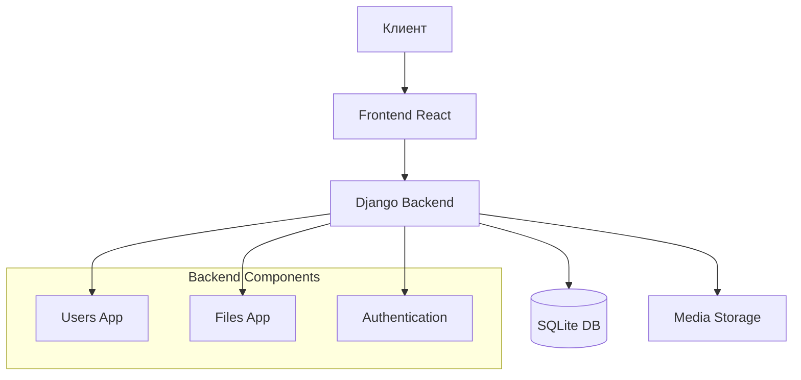
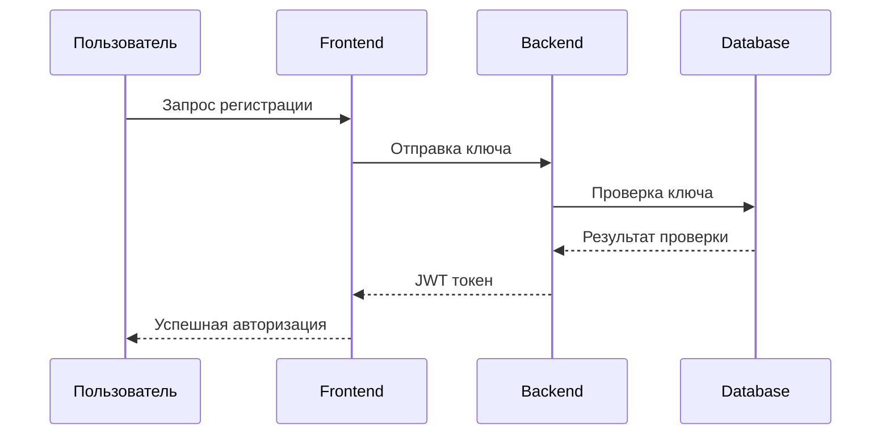
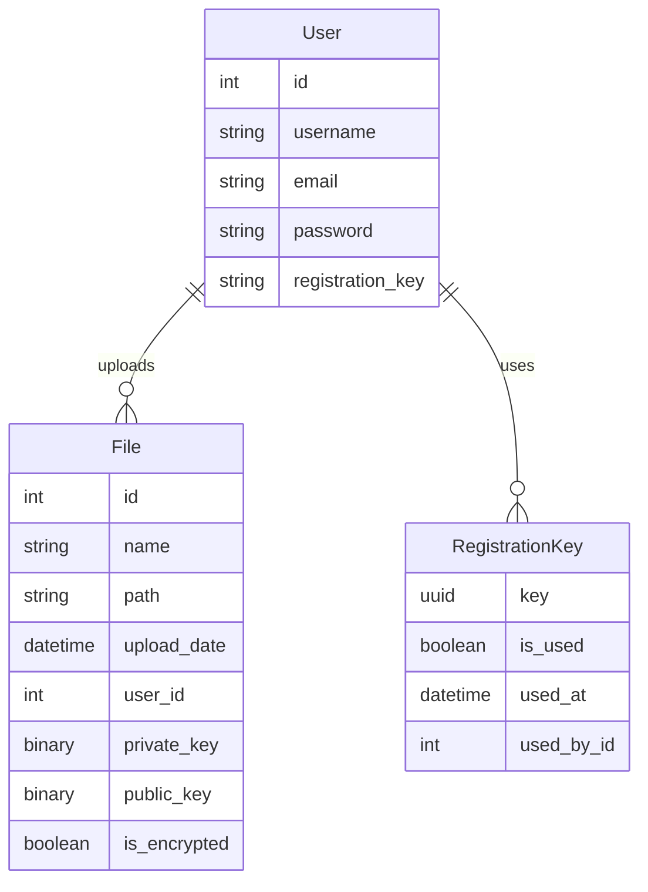
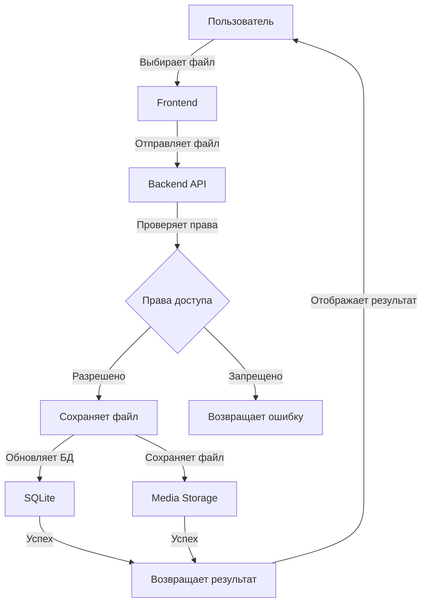
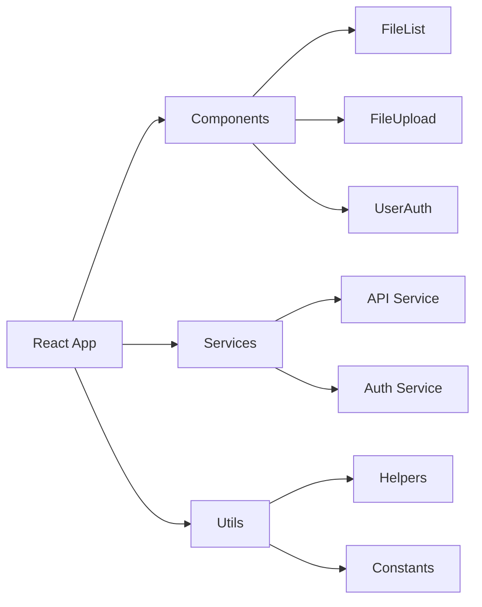
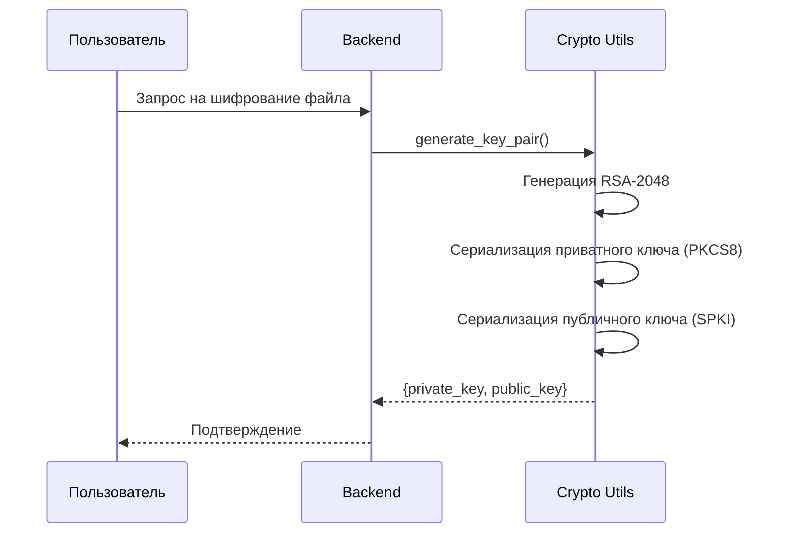
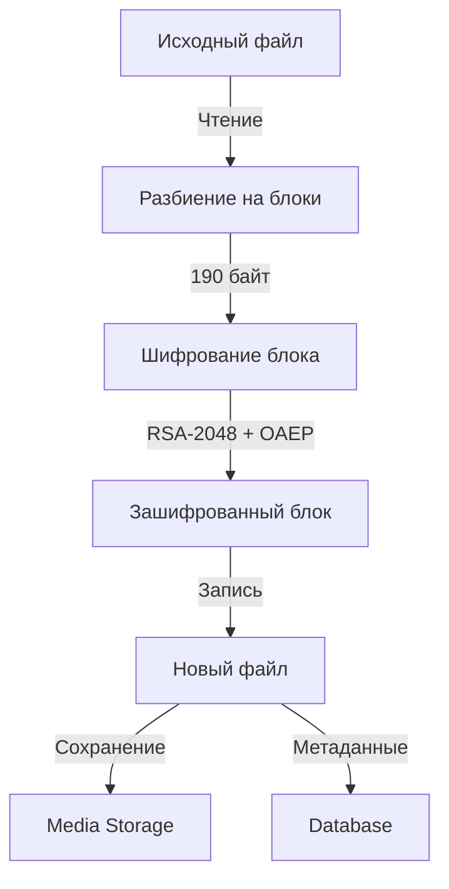

# Архитектура проекта FileManager

## Общее описание
FileManager - это веб-приложение для управления файлами с разделением прав доступа и системой регистрации по ключам.

## Структура проекта
```
FileManager/
├── backend/           # Django бэкенд
├── frontend/         # React фронтенд
├── files/           # Приложение для работы с файлами
├── users/           # Приложение для управления пользователями
├── media/           # Директория для загруженных файлов
├── venv/            # Виртуальное окружение Python
├── manage.py        # Скрипт управления Django
├── requirements.txt # Зависимости Python
└── start.sh         # Скрипт запуска проекта
```

## Диаграммы архитектуры

### Общая архитектура системы


### Процесс аутентификации


### Структура базы данных


### Процесс загрузки файла


### Компоненты фронтенда


## Компоненты системы

### Бэкенд (Django)
- **Django Framework**: Основной фреймворк для бэкенда
- **Django REST Framework**: API для взаимодействия с фронтендом
- **SQLite**: База данных (db.sqlite3)
- **JWT Authentication**: Аутентификация через JWT токены
- **CORS**: Настройки для кросс-доменных запросов

### Фронтенд (React)
- **React**: Основной фреймворк для фронтенда
- **npm**: Менеджер пакетов для JavaScript
- **Tailwind CSS**: Стилизация компонентов
- **React Icons**: Иконки интерфейса

### Основные модули
1. **Модуль пользователей (users/)**
   - Регистрация по UUID ключам
   - JWT аутентификация
   - Управление правами доступа
   - Модель RegistrationKey для управления ключами

2. **Модуль файлов (files/)**
   - Загрузка файлов
   - RSA шифрование файлов
   - Управление доступом к файлам
   - Организация файлов

## Процесс развертывания
1. Создание виртуального окружения Python
2. Установка зависимостей бэкенда
3. Миграции базы данных
4. Установка зависимостей фронтенда
5. Сборка фронтенда
6. Запуск проекта через start.sh

## Безопасность
- Регистрация только по UUID ключам
- JWT аутентификация с refresh токенами
- Разграничение прав доступа к файлам
- Безопасное хранение файлов в media/

### Технические детали шифрования

1. **Шифрование файлов**
   - Использование RSA-2048 для шифрования файлов
   - OAEP padding с SHA-256
   - Размер блока шифрования: 190 байт
   - Хранение ключей в бинарном формате

2. **Безопасность передачи**
   - TLS/SSL для всех соединений
   - JWT токены для аутентификации
   - CORS настройки для безопасности
   - Защита от MITM-атак

3. **Управление ключами**
   - Генерация пары RSA ключей для каждого файла
   - Хранение приватного ключа в базе данных
   - Хранение публичного ключа в базе данных
   - Безопасное хранение ключей в бинарном формате

4. **Контроль доступа**
   - Шифрование метаданных
   - Проверка целостности файлов
   - Логирование доступа
   - Проверка JWT токенов

### Детальный процесс шифрования

#### Генерация ключей


#### Процесс шифрования файла


#### Технические детали реализации

1. **Генерация ключей RSA**
   ```python
   private_key = rsa.generate_private_key(
       public_exponent=65537,
       key_size=2048,
       backend=default_backend()
   )
   ```
   - Размер ключа: 2048 бит
   - Публичная экспонента: 65537 (стандартное значение)
   - Формат приватного ключа: PKCS8
   - Формат публичного ключа: SubjectPublicKeyInfo

2. **Процесс шифрования**
   - Файл разбивается на блоки по 190 байт
   - Каждый блок шифруется отдельно
   - Используется OAEP padding с SHA-256
   - Зашифрованные блоки объединяются в новый файл

3. **Хранение ключей**
   - Приватный ключ: `models.BinaryField(null=True, blank=True)`
   - Публичный ключ: `models.BinaryField(null=True, blank=True)`
   - Ключи хранятся в бинарном формате PEM

4. **Безопасность реализации**
   - Использование криптографически стойкого генератора случайных чисел
   - Безопасное хранение ключей в базе данных
   - Проверка целостности зашифрованных файлов
   - Защита от атак на основе времени

5. **Ограничения RSA**
   - Максимальный размер блока: 190 байт
   - Необходимость разбиения больших файлов
   - Накладные расходы на хранение ключей
   - Влияние на производительность при больших файлах

6. **Процесс дешифрования**
   - Загрузка приватного ключа из базы данных
   - Разбиение зашифрованного файла на блоки
   - Дешифрование каждого блока
   - Объединение блоков в исходный файл

## Масштабируемость
- Модульная архитектура
- Возможность замены SQLite на другую БД
- Отделение фронтенда от бэкенда
- Настройки CORS для распределенной системы
